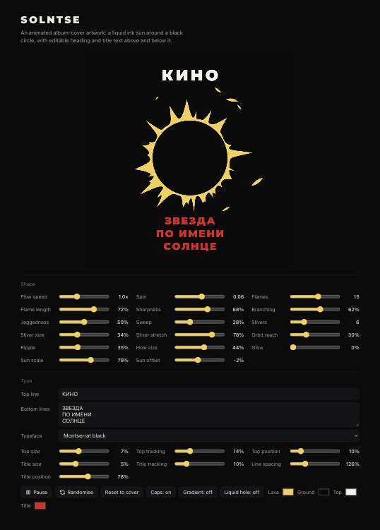

# Solntse

**[solntse.vercel.app](https://solntse.vercel.app)**

An animated album-cover artwork generator: a liquid ink sun around a black circle, with editable
heading and title text above and below it. Everything is drawn on a `<canvas>` at 60fps — the sun's
flames, slivers and ripples are procedural, so no two seeds look alike.

Named after КИНО's *Звезда по имени Солнце* — the cover it defaults back to.



## Usage

Open the page and start moving sliders. The canvas updates live.

- **Top line** and **Bottom lines** start empty. Type your own, one line per row in the textarea.
- **Reset to cover** restores the original КИНО / ЗВЕЗДА ПО ИМЕНИ СОЛНЦЕ artwork and every default.
- **Randomise** reseeds the flame and sliver geometry without touching your slider values.
- **Pause** freezes the animation so you can screenshot a specific frame.

### Controls

**Shape** — `Flow speed`, `Spin`, `Flames`, `Flame length`, `Sharpness`, `Branching`, `Jaggedness`,
`Sweep`, `Slivers`, `Sliver size`, `Sliver stretch`, `Orbit reach`, `Ripple`, `Hole size`, `Glow`,
`Sun scale`, `Sun offset`.

**Type** — text for both lines, typeface (Montserrat black, Oswald, Roboto Condensed, PT Sans
Narrow, or system sans), plus size, letter tracking, line spacing and vertical position for the top
line and the title block independently.

**Toggles** — `Caps` forces uppercase, `Gradient` shades the lava radially, `Liquid hole` makes the
inner circle wobble instead of staying a perfect disc.

**Colours** — lava, ground (background), top text, title.

## Running locally

No build step, no dependencies. It is one HTML file.

```bash
python3 -m http.server 8000
# then open http://localhost:8000
```

Opening `index.html` directly from the filesystem works too.

## How it works

`outerR(theta, t)` returns the sun's radius at a given angle and time. It sums:

1. A base radius with three ripple harmonics.
2. One asymmetric spike per flame — narrow on the leading edge, wide on the trailing edge, so the
   sun reads as spinning even when `Spin` is near zero.
3. Recursive child spikes when `Branching` is up.
4. Four high-frequency sine terms for `Jaggedness`, weighted toward the flame tips.

The outline is then walked at 1180 steps and filled as one path. Detached slivers orbit outside it
as stretched quadratic-curve lozenges, and pull the outline toward them when they pass close — which
is what makes the ink look like it is throwing off droplets rather than having them pasted on.

Randomness comes from a seeded PRNG (`seed()`), so a given seed always rebuilds the same geometry.
